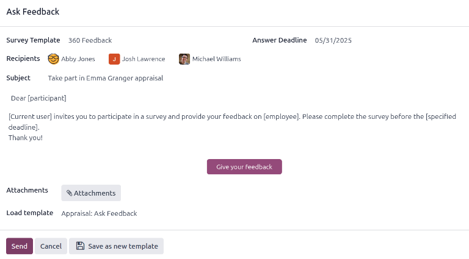
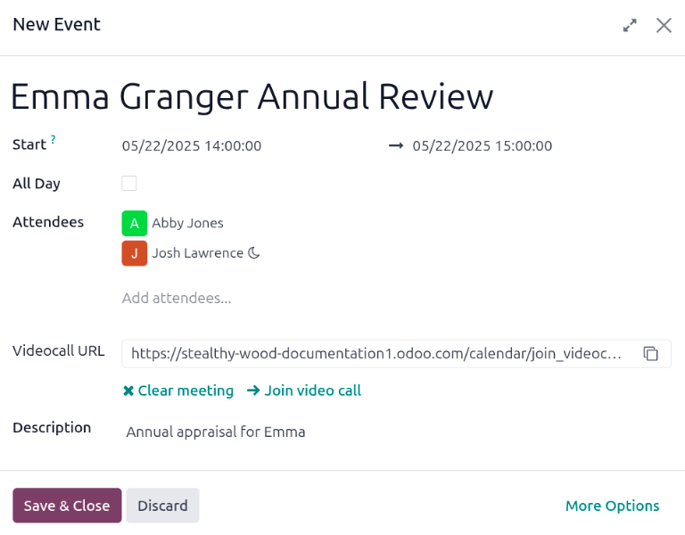

==================
Conduct appraisals
==================

Appraisals give employees an opportunity to :ref:`provide feedback to management
<appraisals/employee-feedback>` on their role, including sharing their day to day activities,
informing management of their goals, and their level of satisfaction with both their job and the
company in general.

:ref:`Manager feedback <appraisals/manager-feedback>` includes acknowledging the employee's
achievements, as well as identifying pain points and areas of improvement, providing a plan of
action to assist the employee in thriving in their role.

Appraisals help both parties better understand the employee's performance and job satisfaction,
which aids in retention, employee engagement, to the benefit of the company.

.. _appraisals/employee-feedback:

Employee feedback
=================

Once an appraisal is confirmed, the next steps require the employee to fill out the self-assessment,
after which the manager completes their assessment.

.. note::
   Only confirmed appraisals can be worked on. If an appraisal is *not* confirmed, the fields on the
   appraisal form cannot be edited, and feedback cannot be recorded.

After the employee receives a notification via email that an appraisal is confirmed and scheduled,
they are requested to fill out their half of the default appraisal template.

The :guilabel:`Employee's Feedback` half of the template includes the following sections:
:guilabel:`My work`, :guilabel:`My future`, and :guilabel:`My feelings`. Each of these sections
consists of several questions for the employee to answer, allowing the employee to perform a
self-assessment, and provide feedback on how they feel about the company and their role.

The employee feedback remains hidden from management while the employee is performing their
self-assessment. Once the employee has completed their half of the appraisal, they tick the gray
:guilabel:`Not Visible to Manager` toggle. This changes the toggle text to :guilabel:`Visible to
Manager`, the color changes to green, and their responses are then visible to management.

Additionally, a green dot appears on the appraisal card on the **Appraisals** app dashboard,
indicating the employee has completed their assessment, and marked their half of the appraisal as
done.

.. _appraisals/manager-feedback:

Manager's Feedback
==================

While the employee is completing their :guilabel:`Employee's Feedback` section, the manager fills
out the :guilabel:`Manager's Feedback` section.

Before the manager fills out their portion of the appraisal, managers typically review the
employee's goals and skills, and ask for :ref:`additional feedback <appraisals/ask-feedback>` from
the employee's coworkers, to better understand all the achievements and challenges for the employee.

Once the manager has all the information they need to fully evaluate the employee, they fill out the
:guilabel:`Manager's Feedback` section of the appraisal form. The manager's half has the following
sections: :guilabel:`Feedback`, :guilabel:`Evaluation`, and :guilabel:`Improvements`.

The managers appraisal focuses on the employee's accomplishments, as well as identifying areas of
improvements, with actionable steps to help the employee achieve their goals in both the long and
short term.

When the feedback section is completed, the manager ticks the :guilabel:`Not Visible to Employee`
toggle. This changes the toggle text to :guilabel:`Visible to Employee`, the color changes to green,
and their responses are then visible to the employee.

.. _appraisals/ask-feedback:

Ask for feedback
----------------

As part of the appraisal process, the manager can request feedback for an employee from anyone in
the company. Feedback is usually requested from coworkers and other people who interact with, or
work with, the employee. This is to get a more well-rounded view of the employee, and aid in the
manager's overall assessment.

To request feedback, the appraisal **must** be confirmed. Once confirmed, an :guilabel:`Ask
Feedback` button appears in the upper-left corner of the form.

To request feedback from a colleague, click the :guilabel:`Ask Feedback` button, and an
:guilabel:`Ask Feedback` email pop-up window appears, using the :guilabel:`Appraisal: Ask Feedback`
email template.

First, using the drop-down menu, select the employees being asked to provide feedback in the
:guilabel:`Recipients` field. Multiple employees may be selected. Next, make any desired changes to
the default message, and attach any relevant documents. To attach a document, click the
:icon:`fa-paperclip` :guilabel:`Attachments` button, and a file explorer window appears. Navigate to
the files, select them, then click :guilabel:`Open`.

The :guilabel:`Answer Deadline` date is automatically set to the day after the :guilabel:`Appraisal
Date` on the appraisal form. Using the calendar selector, modify the date, if desired.

When the email is ready to send, click :guilabel:`Send`, and the feedback requests are sent to the
specified employees.

Appraisal review
================

Once both portions of an appraisal are completed (the :ref:`employee <appraisals/employee-feedback>`
and :ref:`manager <appraisals/manager-feedback>` feedback sections), it is time for the employee and
manager to :ref:`meet and discuss the appraisal <appraisals/schedule>`.

During the appraisal meeting, the manager goes over both the :ref:`Employee's Feedback
<appraisals/employee-feedback>` section as well as their own :ref:`Manager feedback
<appraisals/manager-feedback>`.

Additionally, the employee's :ref:`skills <appraisals/skills>` and goals are reviewed at this time,
and updated as needed.

.. _appraisals/schedule:

Schedule appraisal review
-------------------------

A meeting can be scheduled in one of two ways: either from the **Appraisals** app dashboard, or from
an individual appraisal card.

To schedule an appraisal from the dashboard of the **Appraisals** app, first navigate to
:menuselection:`Appraisals app --> Appraisals`.

Click the activity icon beneath the appraisal date on the desired appraisal card, and an activity
pop-up window appears. Click :icon:`fa-plus` :guilabel:`Schedule an activity`, and a
:guilabel:`Schedule Activity` pop-up window loads.

Using the drop-down menu, select :guilabel:`Meeting` for the :guilabel:`Activity Type`. Doing so
causes the form to change, so only the :guilabel:`Activity Type` and :guilabel:`Summary` fields
appear.

Enter a brief description in the :guilabel:`Summary` field of the :guilabel:`Schedule Activity`
pop-up form, such as `Annual Appraisal for (Employee)`.

Next, click the :guilabel:`Open Calendar` button. From the calendar page that appears, navigate to,
and double-click on, the desired date and time for the meeting.

Doing so opens a :guilabel:`New Event` pop-up form. From this pop-up form, make any desired
modifications, such as designating a :guilabel:`Start` time.

The appraisee populates the :guilabel:`Attendees` section by default. Add anyone else who should be
in the meeting, if necessary.

To make the meeting a video call, instead of an in-person meeting, click :icon:`fa-plus`
:guilabel:`Odoo meeting`, and a :guilabel:`Videocall URL` link appears in the field.

Once all the desired changes are complete, click :guilabel:`Save & Close`.

The meeting now appears on the calendar, and the invited parties are informed, via email.

The other way to schedule a meeting is from the individual appraisal form. To do this, navigate to
the :menuselection:`Appraisal app` dashboard, then click on an appraisal card.

Next, click on the :icon:`fa-calendar` :guilabel:`Meeting` smart button, and the calendar loads.
Follow the same directions above to create the meeting.

For more detailed information on how to schedule activities, refer to the :doc:`activities
<../../essentials/activities>` documentation.

.. note::
   If no meetings are scheduled, the :guilabel:`Meeting` smart button reads :guilabel:`No Meeting`.

.. _appraisals/skills:

Employee skills
---------------

Part of an appraisal is evaluating an employee's skills, and tracking their progress over time. The
:guilabel:`Skills` tab of the appraisal form auto-populates with the skills from the :ref:`employee
form <employees/skills>`, once an appraisal is confirmed.

Each skill is grouped with like skills, and the :guilabel:`Skill Level`, :guilabel:`Progress`, and
:guilabel:`Justification` are displayed for each skill.

:ref:`Update any skills, or add any new skills <employees/skills>` to the :guilabel:`Skills` tab.

If a skill level has increased, enter a reason for the improved rating in the
:guilabel:`Justification` field, such as `took a fluency language test` or `received Javascript
certification`.

After an appraisal is completed, and the skills have been updated, the next time an appraisal is
confirmed, the updated skills populate the :guilabel:`Skills` tab.

.. note::
   The :guilabel:`Skills` tab *can* be modified **after** the employee and their manager have met
   and discussed the employee's appraisal.

   This is a common situation as the manager may not have all the necessary information to properly
   assess and update the employee's skills before meeting.

Complete an appraisal
=====================

After the appraisal has been filled out by both the employee and the manager, and both parties have
met and discussed the employee's performance, the manager then :ref:`logs any notes
<appraisals/notes>`, and :ref:`assigns a rating <appraisals/rate>`.

When completed, click the :guilabel:`Mark as Done` button in the upper-left corner of the appraisal
form.

Once the appraisal is marked as *Done*, the status changes from :guilabel:`Confirmed` to
:guilabel:`Done`, and the :guilabel:`Mark as Done` button changes to a :guilabel:`Reopen` button.

.. tip::
   Modifications are **not** possible once the appraisal is marked as done.

   To make any changes to an appraisal with a status of :guilabel:`Done`, click the
   :guilabel:`Reopen` button, then, click :guilabel:`Confirm`, and make any modifications needed.
   Once all modifications are complete, click the :guilabel:`Mark as Done` button again.

.. _appraisals/notes:

Add a private note
------------------

Managers are able to log notes on an appraisal that are **only** visible to other managers, Enter
any notes in the :guilabel:`Private Note` tab. This can be done anytime during the appraisal
process.

The employee being evaluated does **not** have access to this tab, and the tab does **not** appear
on their appraisal.

This tab is not required to be populated, and does not affect the appraisal rating.

.. _appraisals/rate:

Rate an appraisal
-----------------

After both the manager and employee have met to discuss the employee's performance, the appraisal
must be given a :guilabel:`Final Rating`.

Using the drop-down menu, select the rating for the employee. The default options are:
:guilabel:`Needs improvement`, :guilabel:`Meets expectations`, :guilabel:`Exceeds expectations`,
:guilabel:`Strongly Exceeds Expectations`, and :guilabel:`Good`.

If the default ratings are not sufficient, and a new rating is needed, navigate to
:menuselection:`Appraisals app --> Configuration --> Evaluation Scale`. The default ratings are
presented in a list view. To add a new rating, click the :guilabel:`New` button in the upper-left
corner, and a blank line appears at the bottom of the list. Enter the new rating, then press the
enter key, or click away from the line. Add as many new ratings as needed.

Click :menuselection:`Appraisals` in the top menu to return to the :guilabel:`Appraisals` dashboard,
click on the appraisal, then select the desired :guilabel:`Final Rating`.

.. seealso::
   - :doc:`../appraisals/goals`
   - :doc:`../appraisals/appraisal_analysis`
   - :doc:`../appraisals/skills_evolution`
