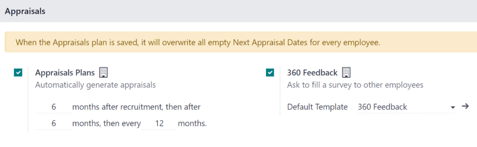
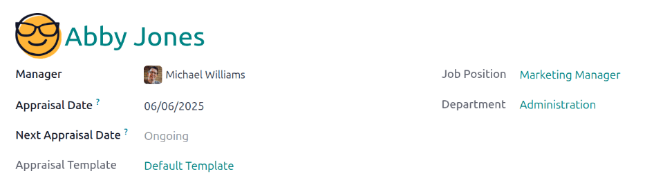

===================
Schedule appraisals
===================

In Odoo, the **Appraisals** application can be used to evaluate employee performance on a recurring
basis. Managers can evaluate the performance of their employees, and also allow employees to do a
self-assessment of their own. Appraisals are customizable, and can be set for any kind of schedule
desired.

Appraisals give employees valuable feedback, including actionable goals to work toward, and
measurable skills to improve upon. Additionally, appraisals may form the basis for raises,
promotions, and other benefits.

Regular appraisals are good for both the employees and the company, since they can accurately
measure performance based on company goals, and show employees where they need to improve.

In Odoo, the **Appraisals** application can automatically schedule appraisals based on an appraisal
plan, as well as manually schedule appraisals anytime they are needed.

Automatic scheduling of appraisals ensures employees receive regular feedback from their managers,
allowing for professional development and growth. Automatically scheduled appraisals eliminates the
need for managers to keep calendar reminders to schedule appraisals, and ensures appraisals are
handled in a timely manner, and annual appraisals are not delayed.

Automatic scheduling
====================

The settings menu in the **Appraisals** app is where appraisal frequencies are set. To access the
settings menu, navigate to :menuselection:`Appraisals app --> Configuration --> Settings`.

The :guilabel:`Appraisals Plan` section of the :guilabel:`Settings` page determines the frequency
that appraisals are performed.

.. _appraisals/appraisal-plan:

Appraisals plans
----------------

By default, appraisals are preconfigured to be automatically created six months after an employee is
hired, with a second appraisal exactly six months after that.

Once those two initial appraisals have been completed in the employee's first year, following
appraisals are only created once a year (every twelve months).

To modify this schedule, change the number of months in the blank fields under the
:guilabel:`Appraisals Plans` section.

.. important::
   If the :guilabel:`Appraisals Plans` section is modified, **all** empty :guilabel:`Next Appraisal
   Dates` are modified for **all** employees.

Appraisals automation
---------------------

Tick the checkbox next to :guilabel:`Appraisals Automation` to have Odoo automatically schedule
*and* confirm appraisals.

Appraisals are scheduled according to the :ref:`appraisal plan. <appraisals/appraisal-plan>`.

Schedule an appraisal
=====================

Appraisals can be scheduled anytime an employee's manager or supervisor wants, and do not have to
keep to the appraisal schedule.

Sometimes an appraisal is needed before an employee's next scheduled appraisal. This can happen when
an employee is promoted, or transfers to a new role or a new department. When this happens,
typically an appraisal is performed, to evaluate the employee's performance in their current role,
before moving to their new role.

To create a new appraisal, open the :menuselection:`Appraisals` app, and click the :guilabel:`New`
button in the upper-left corner. This opens a blank :guilabel:`Appraisals` form.

First, using the drop-down menu, select the employee being evaluated, in the first field on the
form. Once an employee is selected, the employee's :guilabel:`Manager`, :guilabel:`Jobb Position`,
and :guilabel:`Department` fields are populated according to the information on the employee record.

The current date populates the :guilabel:`Appraisal Date` field, which is the date the appraisal is
scheduled to be completed. Using the calendar selector, adjust the date, if desired. This field is
typically updated when the manager submits their final rating at the end of the appraisal process.

If there is an :ref:`appraisal plan <appraisals/appraisal-plan>` configured, the :guilabel:`Next
Appraisal Date` field displays :guilabel:`Ongoing`. This indicates that the following appraisal will
be scheduled according to the appraisal schedule. Once the appraisal is marked as complete, the
:guilabel:`Next Appraisal Date` is updated with the date of the next appraisal.

Last, select the desired :guilabel:`Appraisal Template`. The :guilabel:`Default Template` populates
this field, by default, and is created when the **Appraisals** app is installed. Using the drop-down
menu, select a different template, if desired.

Once the information in the top-half of the :guilabel:`Appraisals` form is complete, click the
:guilabel:`Confirm` button in the upper-left corner, and the appraisal is scheduled, and the
employee is notified.

Once the appraisal is confirmed, both the employee and manager can start to fill out the appraisal.

