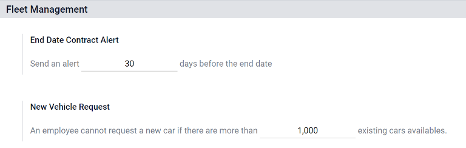
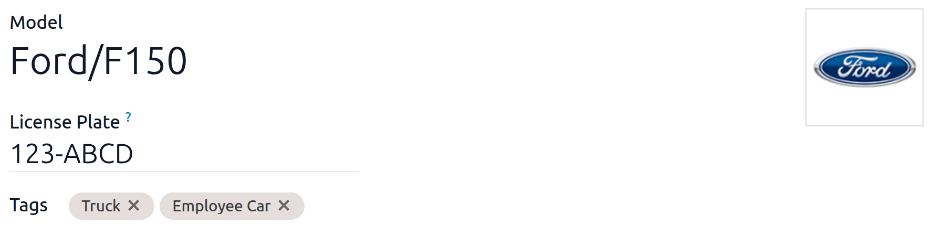
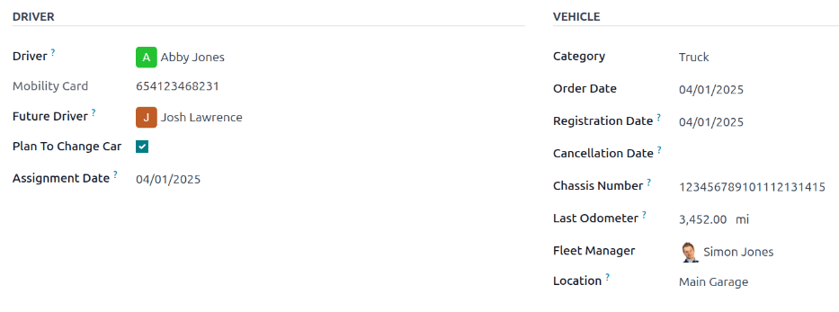
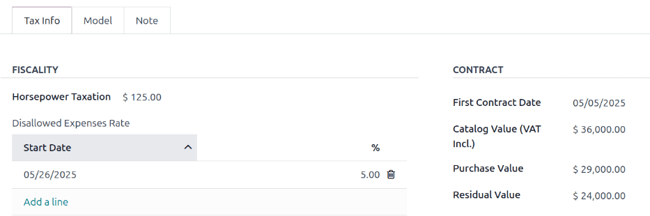
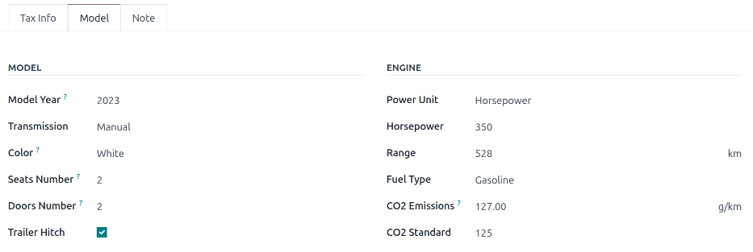

:show-content:

===============
Adding vehicles
===============

Odoo's **Fleet** app manages all vehicles, and the accompanying documentation that comes with
vehicle maintenance and driver records.

Upon opening the :menuselection:`Fleet` application, all vehicles are organized within the
:guilabel:`Vehicles` dashboard, which is the default dashboard. Each vehicle is displayed in its
corresponding Kanban stage, based on its status. The default stages are :guilabel:`New Request`,
:guilabel:`To Order`, :guilabel:`Registered`, and :guilabel:`Downgraded`.

Additionally, two settings affect the **Fleet** app and should be :ref:`reviewed and configured
<fleet/settings>` before adding vehicles.

.. _fleet/settings:

Settings
========

To access the settings menu, go to :menuselection:`Fleet app --> Configuration --> Settings`. Only
two settings need configuration: :guilabel:`End Date Contract Alert` and :guilabel:`New Vehicle
Request`.

End Date Contract Alert
-----------------------

The :guilabel:`End Date Contract Alert` field shows how many days before the end of a vehicle
contract an alert should be sent. The responsible people receive an email informing them that a
vehicle contract is about to expire in the number of days defined in this field.

.. note::
   To determine the responsible person is for a contract, open an individual contract. The person
   listed as :guilabel:`Responsible` under the :guilabel:`Contract Information` section of the
   contract receives the alert.

   To access all contracts, navigate to :menuselection:`Fleet app --> Fleet --> Contracts` and all
   contracts appear in the list. Click on a :guilabel:`Contract` to view it.

   An individual contract can also be found by navigating to :menuselection:`Fleet app --> Fleet -->
   Fleet` and clicking on an individual vehicle. On the vehicle form, click the
   :guilabel:`Contracts` smart button at the top of the page. Only contracts associated with the
   vehicle appear in the list. Click on an individual contract to open it. The
   :guilabel:`Responsible` person is listed on the contract.

New Vehicle Request
-------------------

The :guilabel:`New Vehicle Request` field limits how many new vehicles are requested based on fleet
availability. An employee filling out the salary configurator form (after being offered a position),
will *not* be able to request a new car if the number of existing cars is greater than the number
specified in the :guilabel:`New Vehicle Request` field. Enter the specific number limit for the
existing available cars in this field.

.. example::
   If the :guilabel:`New Vehicle Request` limit is set to 20 vehicles, and there are 25 vehicles
   available, an employee would not be able to request a new vehicle. If there are only 10 cars
   available, then the employee would be able to request a new vehicle.

.. note::
   This settings option **only** appears if the :guilabel:`Belgian-Payroll-Fleet` module is
   installed for the Belgian localization.

Add a vehicle
=============

To add a new vehicle to the fleet from the :guilabel:`Vehicles` dashboard, click the :guilabel:`New`
button in the top-left corner, and a blank vehicle form loads. Then, proceed to enter the vehicle
information on the vehicle form.

.. _fleet/new_vehicle/vehicle-form:

Vehicle form fields
===================

- :guilabel:`Model`: Using the drop-dpown menu, select the vehicle's model. Once a model is
  selected, additional fields may appear on the form. If the model is not listed, type in the model
  name, and click either :guilabel:`Create "model"`, or :guilabel:`Create and edit...` to
  :ref:`create a new model and edit the model details <fleet/add-model>`.
- :guilabel:`License Plate`: Enter the vehicle's license plate number.
- :guilabel:`Tags`: Select any tags from the drop-down menu, or type in a new tag. There is no limit
  on the amount of tags that can be selected.

.. note::
   The :guilabel:`Model` is the *only* required field on the new vehicle form. When a model is
   selected, other fields appear on the vehicle form, and relevant information auto-populates the
   fields that apply to the model. If some of the fields do not appear, this may indicate there is
   no model selected.

.. _fleet/new_vehicle/new-driver:

Driver
------

This section of the vehicle form relates to the person who is currently driving the car, as well as
any plans for a change in the driver in the future, and when.

- :guilabel:`Driver`: Using the drop-down menu, select the driver, or type in a new driver and click
  either :guilabel:`Create "driver"` or :guilabel:`Create and edit...` to :ref:`create a new driver,
  and edit the driver details <fleet/new_vehicle/add-driver>`.

  .. important::
     A driver does *not* have to be an employee. When creating a new driver, the driver is added to
     the **Fleet** app, *not* the **Employees** app.

     If the **Contacts** application is installed, the driver information is also stored there.

- :guilabel:`Mobility Card`: If the selected driver has a mobility card listed on their employee
  record in the **Employees** application, the mobility card number automatically appears in this
  field. If there is no mobility card listed, and one should be added, :ref:`edit the employee
  record <employees/hr-settings>` in the **Employees** application.
- :guilabel:`Future Driver`: If the next driver for the vehicle is known, select the next driver
  from the drop-down menu. Or, type in the next driver and click either :guilabel:`Create "future
  driver"` or :guilabel:`Create and edit...` to :ref:`create a new future driver, and edit the
  driver details <fleet/new_vehicle/add-driver>`.
- :guilabel:`Plan To Change Car`: If the current driver set for this vehicle plans to change their
  vehicle - either because they are waiting on a new vehicle that is being ordered, or this is a
  temporary vehicle assignment, and they know which vehicle they are driving next - tick this box.
  Do **not** tick this box if the current driver does not plan to change their vehicle.
- :guilabel:`Assignment Date`: Using the calendar selector, select when the vehicle is available for
  another driver. If this field is left blank, that indicates the vehicle is currently available,
  and can be assigned to another driver. If it is populated, the vehicle is not available for
  another driver until the selected date.
- :guilabel:`Company`: Select the company from the drop-down menu. This field only appears in a
  multi-company database.

.. _fleet/new_vehicle/add-driver:

Create a new driver
~~~~~~~~~~~~~~~~~~~

If a driver is not already in the system, the new driver should first be configured and added to the
database. A new driver can be added either from the :guilabel:`Driver` or :guilabel:`Future Driver`
fields on the :ref:`vehicle form <fleet/new_vehicle/vehicle-form>`.

First, type in the name of the new driver in either the :guilabel:`Driver` or :guilabel:`Future
Driver` field, then click :guilabel:`Create and edit...`. A :guilabel:`Create Driver` or
:guilabel:`Create Future Driver` form appears, depending on which field initiated the form.

Both the :guilabel:`Create Driver` and :guilabel:`Create Future Driver` forms are identical, and are
stored in the **Contacts** app. :doc:`Configure the new contact <../../essentials/contacts>`, then
click :guilabel:`Save & Close`.

.. note::
   Depending on the installed applications, different tabs or fields may be visible on the
   :guilabel:`Create Driver` and :guilabel:`Create Future Driver` forms.

.. _fleet/new_vehicle/general-info:

Vehicle
-------

This section of the vehicle form relates to the physical details of the vehicle.

If a preexisting vehicle in the database was selected for the :guilabel:`Model` field in the top
portion of the form, some fields may auto-populate, and additional fields may also appear.

Fill in the following fields on the form:

- :guilabel:`Category`: Using the drop-down menu, select the vehicle category from the available
  options. To create a new category, type in the new category name, then click :guilabel:`Create
  "category"`.
- :guilabel:`Order Date`: Using the calendar selector, select the date the vehicle was ordered.
- :guilabel:`Registration Date`: Using the calendar selector, select the date the vehicle was
  registered.
- :guilabel:`Cancellation Date`: Using the calendar selector, select the date the vehicle lease
  expires, or when the vehicle is no longer available.
- :guilabel:`Chassis Number`: Enter the chassis number in the field. This is known in some countries
  as the :abbr:`VIN (Vehicle Identification Number)` number.
- :guilabel:`Last Odometer`: Enter the last known odometer reading in the number field. Using the
  drop-down menu next to the number field, select whether the odometer reading is in kilometers
  :guilabel:`(km)` or miles :guilabel:`(mi)`.
- :guilabel:`Fleet Manager`: Select the fleet manager from the drop-down menu, or type in a new
  fleet manager, and click either :guilabel:`Create` or :guilabel:`Create and Edit`.
- :guilabel:`Location`: Type in the specific location where the vehicle is typically located in this
  field. The entry should clearly explain where the vehicle can be found, such as `Main Garage` or
  `Building 2 Parking Lot`.

Tax Info tab
------------

Depending on the localization setting for the database, and what additional applications are
installed, other fields may be present on the form.

The sections below are default and appear for all vehicles, regardless of other installed
applications or localization settings.

Fiscality
~~~~~~~~~

- :guilabel:`Horsepower Taxation`: Enter the amount that is taxed based on the size of the vehicle's
  engine. This is determined by local taxes and regulations, and varies depending on the location.
  It is recommended to check with the accounting department to ensure this value is correct.
- :guilabel:`Disallowed Expenses Rate`: Configure the dates and percentages of the vehicle-related
  costs (fuel, maintenance, depreciation, etc.) that **cannot** be deducted from the company's
  taxable income.

Contract
~~~~~~~~

- :guilabel:`First Contract Date`: Select the start date for the vehicle's first contract using the
  calendar selector. Typically this is the day the vehicle is purchased or leased.
- :guilabel:`Catalog Value (VAT Incl.)`: Enter the :abbr:`MSRP (Manufacturer's Suggested Retail Price)`
  for the vehicle at the time of purchase or lease.
- :guilabel:`Purchase Value`: Enter the purchase price or the original value of the lease for the
  vehicle.
- :guilabel:`Residual Value`: Enter the current value of the vehicle.

.. note::
   The values listed above affect the accounting department. It is recommended to check with the
   accounting department for more information and/or assistance with these values.

Model tab
---------

If the model for the new vehicle is already configured in the database, the :guilabel:`MODEL` and
:guilabel:`ENGINE` sections are populated with the corresponding information. If the model is *not*
already in the database and the :guilabel:`Model` tab needs to be configured, :ref:`configure the
new vehicle model <fleet/add-model>`.

Check the information in the :guilabel:`Model` tab to ensure it is accurate. For example, the color
of the vehicle, or if a trailer hitch is installed, are examples of common information that may need
updating.

Note tab
--------

Enter any notes for the vehicle in this section.

.. seealso::
   - :doc:`../fleet/models`
   - :doc:`../fleet/service`
   - :doc:`../fleet/accidents`
